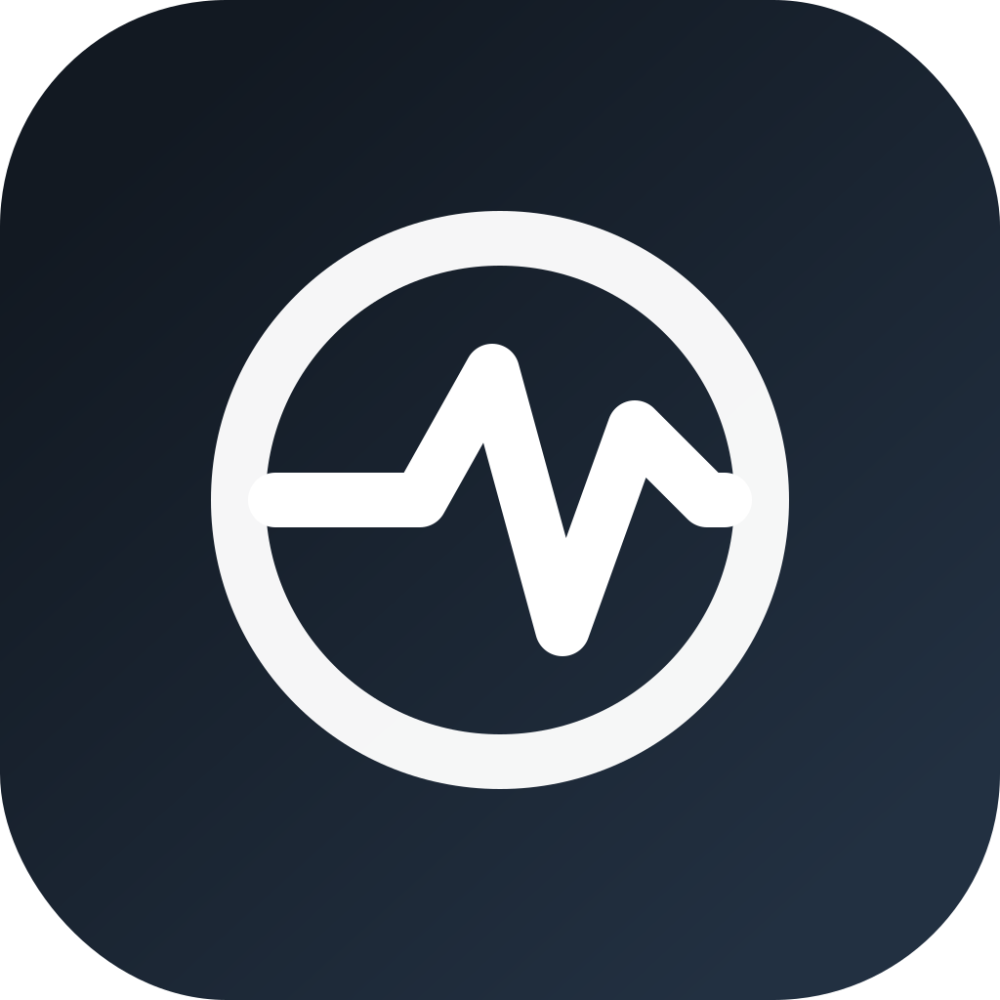
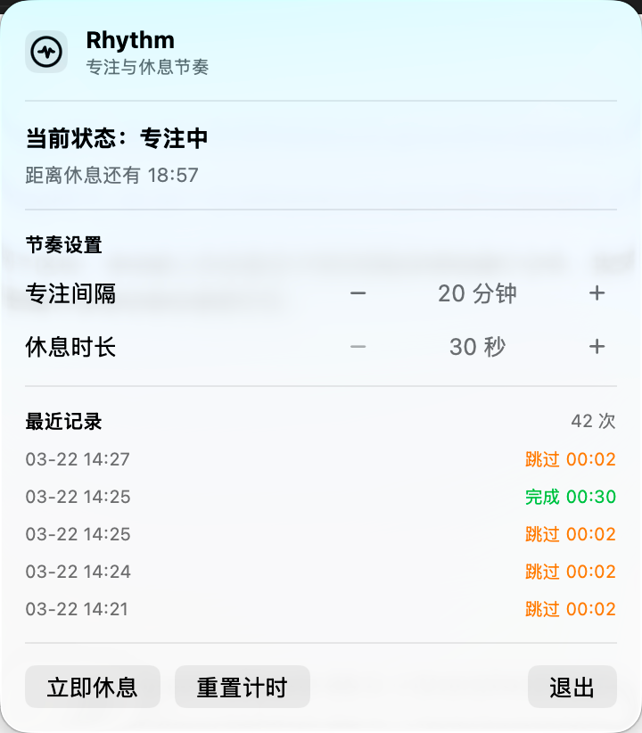

# Rhythm

Rhythm 是一个 macOS 节奏提醒工具，帮助用户建立稳定的「专注-休息」电脑使用节奏。



## 界面预览



## V1 功能

- 自定义节奏：可设置专注间隔（10-120 分钟，5 分钟步进）和休息时长（30 秒-10 分钟，常用档位）
- 锁屏重置：检测到系统锁屏后重置当前计时周期
- 休息遮罩：到点展示全屏半透明遮罩，支持 `ESC` 跳过
- 数据记录：保存每次休息的计划时长、实际时长、是否跳过
- 菜单栏应用：常驻状态栏，快速查看状态与最近记录

## 技术栈

- Swift 6
- SwiftUI + AppKit
- Swift Package Manager

## 本地运行

```bash
swift build
swift run Rhythm
```

> 注意：需要在 macOS 环境运行。首次运行可能需要在系统设置中允许应用窗口置顶或辅助功能能力（取决于系统策略）。

## TDD 回归检查

```bash
swift run RhythmTDD
```

该命令会执行一组可重复的回归检查，覆盖：

- 设置变更回调、范围归一化与历史配置迁移
- 跳过休息后的 session 记录
- 锁屏导致的计时周期重置
- 休息遮罩可见性与焦点（自动 smoke）

如需临时跳过 UI 集成 smoke：

```bash
RHYTHM_TDD_UI=0 swift run RhythmTDD
```

手动跑遮罩 smoke（默认仅输出 smoke 流程日志）：

```bash
RHYTHM_SMOKE_OVERLAY=1 swift run Rhythm
```

如需输出遮罩焦点细节日志，再加：

```bash
RHYTHM_SMOKE_OVERLAY=1 RHYTHM_OVERLAY_DEBUG=1 swift run Rhythm
```

## 项目结构

```txt
.
├── docs/
│   └── V1-design.md
├── Sources/
│   ├── RhythmApp/
│   │   ├── AppModel.swift
│   │   ├── LockMonitor.swift
│   │   ├── MenuBarView.swift
│   │   ├── OverlayManager.swift
│   │   └── RhythmApp.swift
│   ├── RhythmCore/
│   │   ├── Persistence.swift
│   │   └── TimerEngine.swift
│   └── RhythmTDD/
│       └── main.swift
└── Package.swift
```

## 开源

- License: MIT
- 欢迎通过 Issue / PR 贡献

## 品牌资产

- Logo 源文件：`assets/rhythm-logo.svg`
- 面板截图：`assets/menu-panel.png`
